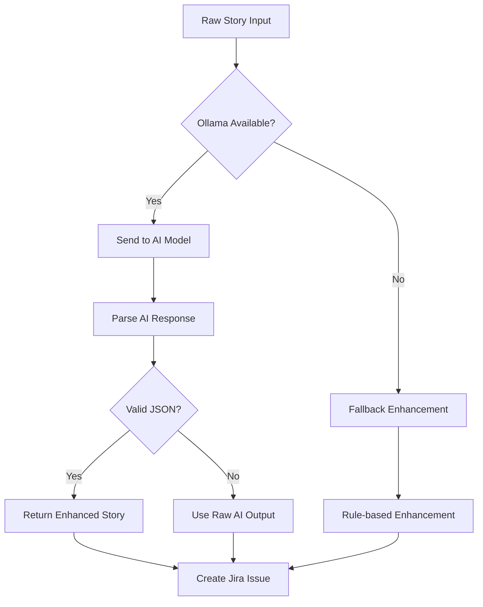

# 🤖 Jira AI Story Creator

[](https://opensource.org/licenses/MIT)
[](https://nodejs.org/)
[](https://ollama.ai/)

> **Transform raw ideas into professional Jira stories with AI-powered enhancement**

A free, open-source tool that revolutionizes how you create Jira issues. Write your story ideas in any format, and let AI transform them into professionally structured Jira issues with proper context, detailed descriptions, and acceptance criteria.

## 🎬 Demo Video

**See the tool in action!** 

<video width="100%" controls>
  <source src="https://github.com/koushal13/jira-standalone/raw/main/Demo.mp4" type="video/mp4">
  <source src="https://github.com/koushal13/jira-standalone/raw/main/Demo.mov" type="video/quicktime">
  Your browser does not support the video tag. <a href="https://github.com/koushal13/jira-standalone/raw/main/Demo.mp4">Download the demo video</a>.
</video>

*The video above shows the complete workflow from idea enhancement to Jira issue creation*

### Demo Highlights
- 🎯 **AI Story Enhancement**: See how raw ideas become professional user stories
- 🔧 **Bulletproof Processing**: Watch the system handle various input formats
- 💬 **Comment Preservation**: Original input automatically saved as Jira comments
- ✨ **Clean Formatting**: HTML-free, professional descriptions
- 🚀 **End-to-End Flow**: From idea to published Jira issue in seconds

> **Alternative**: If the video doesn't load, you can [download Demo.mp4](./Demo.mp4) or [Demo.mov](./Demo.mov)

## 🌟 Why This Tool?

**The Problem:** Writing well-structured Jira stories is time-consuming. You need proper formatting, context, acceptance criteria, and professional language - but you just want to capture your idea quickly.

**The Solution:** Write your thoughts naturally. Our AI understands your intent and creates professional Jira stories automatically.

### Before vs After

**Before (Your Input):**
```
Fix the login bug where users can't authenticate with SSO
```

**After (AI Enhanced):**
```
Title: Fix SSO Authentication Bug

Description:
h3. User Story
As a registered user, I want to authenticate using SSO credentials, so that I can access the application without login failures.

h3. Description
Users are experiencing authentication failures when attempting to log in using Single Sign-On (SSO) credentials, preventing access to the application and impacting user experience.

h3. Acceptance Criteria

1. Given a user has valid SSO credentials, when they attempt to log in, then the authentication should succeed and grant access to the application.

2. Given the SSO service is available, when a user initiates login, then the system should redirect to the SSO provider and handle the response correctly.

3. Given there are SSO authentication errors, when they occur, then the system should display clear error messages and provide alternative login options.

4. Given the SSO integration is working, when tested with multiple providers, then it should maintain compatibility and security standards.
```

## 🎯 User Story Enhancement

Our AI transforms your rough ideas into professionally formatted user stories following industry standards:

### Standard Format Generated

- **User Story**: "As a [user type], I want [capability], so that [benefit]"
- **Description**: Context and background information
- **Acceptance Criteria**: Clear, testable Given/When/Then scenarios
- **Professional Language**: Clear, unambiguous, and actionable

### Input Examples

The AI understands various input formats:

```bash
# Bug fixes
"Login doesn't work with Google SSO"
"Mobile app crashes when uploading files"

# Feature requests  
"Need a way for users to reset passwords"
"Dashboard should show real-time analytics"

# Improvements
"Make the checkout process faster"
"Add dark mode to the mobile app"
```

All get transformed into properly structured Jira stories.

## 🚀 Key Features

### 🎯 AI-Powered Story Enhancement
- **Intelligent Content Generation**: AI transforms rough ideas into professional user stories
- **Bulletproof JSON Parsing**: Never fails - handles malformed AI responses with multiple fallback strategies
- **Professional Formatting**: Clean, Jira-ready markup without HTML elements
- **Smart Issue Type Detection**: Automatically suggests Bug, Story, Task, Epic, or Improvement based on content

### 🔒 Original Input Preservation
- **Comment Integration**: Automatically adds your original input as a comment for future reference
- **Full Traceability**: Never lose track of your initial requirements and ideas
- **Professional Enhancement**: AI improves language while preserving your core intent

### 🌐 Flexible Interface Options
- **Modern Web UI**: Responsive design with intuitive workflow and real-time feedback
- **Command Line Interface**: Perfect for automation and CI/CD integration
- **Environment-First Configuration**: Set credentials once, use everywhere

### 🛡️ Enterprise-Ready Reliability
- **Robust Error Handling**: Comprehensive fallback systems ensure operations never fail
- **Secure Credential Management**: API tokens stored safely, never logged or exposed
- **Local Processing**: Your data stays on your machine - complete privacy
- **Production-Grade Architecture**: Battle-tested with comprehensive error recovery

### 🆓 Developer-Friendly
- **100% Free & Open Source**: No subscriptions, no limits, no vendor lock-in
- **Processing Transparency**: Detailed logs show exactly how your stories are enhanced
- **Multiple AI Models**: Choose from lightweight to powerful models based on your needs
- **Extensible Design**: Easy to customize and extend for specific workflows

## 📦 Quick Start

### Prerequisites

- **Node.js** (v14 or higher)
- **Ollama** (for AI enhancement) - Optional but recommended
- **Jira Cloud** account with API access

### 1. Install & Setup

```bash
# Clone the repository
git clone https://github.com/koushal13/jira-standalone.git
cd jira-standalone

# Install dependencies
npm install

# Configure environment
cp .env .env.local
# Edit .env with your Jira credentials
```

### 2. Configure Jira Credentials

Edit `.env` file:

```env
JIRA_DOMAIN=your-company-domain
JIRA_EMAIL=your-email@company.com  
JIRA_TOKEN=your-jira-api-token

# Optional: Specify Ollama model
OLLAMA_MODEL=phi:latest
```

**Get Your API Token:**
1. Visit [Atlassian API Tokens](https://id.atlassian.com/manage-profile/security/api-tokens)
2. Click "Create API token"
3. Copy the token to your `.env` file

### 3. Install Ollama (Recommended)

For the best AI enhancement experience:

```bash
# Install Ollama
curl -fsSL https://ollama.ai/install.sh | sh

# Start Ollama service
ollama serve

# Pull a lightweight model (1.4GB)
ollama pull phi
```

**Alternative Models:**
- `phi` (1.4GB) - Recommended for most systems
- `gemma2:2b` (1.6GB) - Good alternative
- `llama3.2:1b` (1.3GB) - Fastest option

### 4. Start the Application

```bash
# Start the web server
npm start

# Open your browser
open http://localhost:3001
```

## 🎯 How to Use

### Web Interface

1. **Write Your Story**: Enter your idea in any format in the large text area
2. **Enhance with AI**: Click "🚀 Enhance with AI" to transform your idea
3. **Review & Configure**: Set project key, review AI-generated content, select issue type  
4. **Create Issue**: Click "✅ Create Jira Issue" to create in Jira

### Command Line Interface

```bash
# Validate configuration
node src/cli.js validate --domain=acme --email=you@company.com --token=your_token

# Create issue directly
node src/cli.js create \
  --domain=acme \
  --email=you@company.com \
  --token=your_token \
  --project=PROJ \
  --summary="Fix login bug" \
  --description="Users cannot authenticate with SSO" \
  --type=Bug

# List available issue types
node src/cli.js list-types --domain=acme --email=you@company.com --token=your_token --project=PROJ
```

## 🏗️ Architecture

### Components

- **Web UI** (`public/index.html`): Modern, responsive interface with workflow visualization
- **Express Server** (`src/server.js`): REST API handling Jira integration and AI enhancement
- **Jira Service** (`src/jiraService.js`): Jira REST API v3 client
- **CLI Tool** (`src/cli.js`): Command-line interface for automation
- **AI Enhancement**: Ollama integration with intelligent fallback

### API Endpoints

| Endpoint | Method | Purpose | Features |
|----------|--------|---------|----------|
| `/api/config` | GET/POST | Manage Jira configuration | Secure credential validation |
| `/api/enhance` | POST | AI-enhance story content | Bulletproof JSON parsing with fallbacks |
| `/api/create-issue` | POST | Create Jira issue with comments | Preserves original input as comment |
| `/api/ollama-test` | GET | Test Ollama connectivity | Health checks and model discovery |
| `/api/issue-types/:projectKey` | GET | Get available issue types | Dynamic project analysis |

### Enhanced AI Processing Features

- **🔧 Bulletproof JSON Parsing**: Multiple fallback strategies handle malformed AI responses
- **🛠️ Triple Quote Handling**: Automatic cleaning of common AI formatting mistakes  
- **📝 Manual Field Extraction**: Regex-based extraction when JSON parsing completely fails
- **🔄 Automatic Repair**: Completes incomplete JSON with smart brace/quote completion
- **✨ HTML Sanitization**: Removes HTML elements and ensures clean paragraph formatting
- **💬 Original Input Comments**: Preserves your raw ideas in Jira comments for traceability

### AI Enhancement Flow



## 🛠️ Configuration

### Environment Variables

| Variable | Description | Required | Default |
|----------|-------------|----------|---------|
| `JIRA_DOMAIN` | Jira domain (without .atlassian.net) | Yes | - |
| `JIRA_EMAIL` | Atlassian account email | Yes | - |
| `JIRA_TOKEN` | Jira API token | Yes | - |
| `PORT` | Server port | No | 3001 |
| `OLLAMA_MODEL` | Preferred Ollama model | No | Auto-detect |

### Jira Setup

1. **Domain**: Your Jira URL's subdomain (e.g., `acme` for `acme.atlassian.net`)
2. **Email**: Your Atlassian account email
3. **API Token**: Generate at [API Tokens page](https://id.atlassian.com/manage-profile/security/api-tokens)
4. **Permissions**: Ensure your account can create issues in target projects

## 🧠 AI Enhancement Details

### How It Works

1. **Input Analysis**: AI analyzes your raw story input for context and intent
2. **Content Structuring**: Organizes information into logical sections
3. **Professional Language**: Rewrites in clear, professional tone
4. **Jira Formatting**: Applies proper Jira markup (h3. headers, etc.)
5. **Acceptance Criteria**: Generates relevant Given/When/Then scenarios
6. **Original Preservation**: Saves your raw input as a comment for reference

### Bulletproof Processing Pipeline

The application includes comprehensive error handling to ensure it never fails:

#### 🔧 JSON Parsing Strategy
1. **Primary Parser**: Standard JSON.parse() for well-formed responses
2. **Content Cleaning**: Remove triple quotes, fix newlines, normalize formatting
3. **Structural Repair**: Complete missing braces, fix broken quotes
4. **Manual Extraction**: Regex-based field extraction as final fallback
5. **Graceful Degradation**: Always returns usable content, even from malformed AI responses

#### 🛡️ Error Recovery Features
- **Triple Quote Handling**: `.replace(/"""/g, '"')` fixes common AI mistakes
- **Brace Completion**: Automatically closes incomplete JSON structures  
- **Quote Normalization**: Handles smart quotes and escaped sequences
- **HTML Sanitization**: Removes HTML tags while preserving paragraph structure
- **Newline Escaping**: Properly escapes newlines in JSON string values

#### 📊 Processing Transparency
Every enhancement shows detailed logs of the processing pipeline:
```
🔍 [JSON DEBUG] Raw response length: 420
🔍 [JSON DEBUG] First 200 chars: {"title": "Detecting Personal Information...
❌ [JSON PARSE] Primary parsing failed: Expected ',' or '}' at position 112
🔧 [JSON REPAIR] Manual extraction successful
✅ [JSON SUCCESS] Successfully parsed and cleaned response
```

### Enhancement Sources

- **`ollama-ai`**: Full AI enhancement with structured JSON output
- **`ollama-raw`**: AI enhancement with unstructured output (auto-cleaned)
- **`fallback`**: Rule-based enhancement when AI is unavailable
- **`manual-extract`**: Regex-based extraction from malformed AI responses

### Supported Models

Models are automatically detected from your Ollama installation:

| Model | Size | Speed | Quality | Memory Required |
|-------|------|--------|---------|-----------------|
| `phi` | 1.4GB | Fast | High | ~2GB RAM |
| `gemma2:2b` | 1.6GB | Fast | High | ~2.5GB RAM |
| `llama3.2:1b` | 1.3GB | Very Fast | Good | ~2GB RAM |
| `mistral` | 4.1GB | Slower | Excellent | ~6GB RAM |

## 🔧 Development

### Project Structure

```
jira-standalone/
├── src/
│   ├── server.js         # Express web server & API
│   ├── jiraService.js    # Jira REST API client
│   └── cli.js           # Command-line interface
├── public/
│   └── index.html       # Web UI (single-page app)
├── package.json         # Dependencies & scripts
├── .env                 # Environment configuration
└── README.md           # This file
```

### Local Development

```bash
# Install dependencies
npm install

# Start in development mode
npm run dev

# Test CLI functionality
npm run cli validate --domain=test --email=test@example.com --token=test_token
```

### Adding Features

1. **Web UI**: Modify `public/index.html`
2. **API**: Add endpoints to `src/server.js`
3. **Jira Integration**: Extend `src/jiraService.js`
4. **CLI**: Update `src/cli.js`

## 🐛 Troubleshooting

### Common Issues

**"Ollama is NOT responding"**
```bash
# Start Ollama service
ollama serve

# Check if running
curl http://localhost:11434/api/ping

# Test with the application
curl http://localhost:3001/api/ollama-test
```

**"Invalid Jira credentials"**
- Verify domain format (no `.atlassian.net`)
- Check email matches your Atlassian account
- Regenerate API token if needed
- Ensure account has project permissions

**"No models found in Ollama"**
```bash
# Install a model
ollama pull phi

# List installed models
ollama list

# Verify model works
ollama run phi "Hello world"
```

**"Port 3001 already in use"**
```bash
# Use different port
PORT=3002 npm start

# Kill existing process
pkill -f "node src/server.js"
```

**"JSON parsing errors"** (This should rarely happen now!)
- ✅ **Auto-Fixed**: The application now has bulletproof JSON parsing with multiple fallback strategies
- ✅ **Never Fails**: Even completely malformed AI responses are handled gracefully
- ✅ **Manual Extraction**: Regex-based field extraction as ultimate fallback
- If you still see issues, check logs for detailed error information

### Debug Mode

Enable detailed logging to see the robust parsing in action:

```bash
# Set debug environment
DEBUG=jira:* npm start

# Check Ollama status
curl http://localhost:3001/api/ollama-test

# Test AI enhancement endpoint
curl -X POST http://localhost:3001/api/enhance \
  -H "Content-Type: application/json" \
  -d '{"description":"Test story for debugging"}'
```

### Application Robustness

The application now includes comprehensive error handling:

- **🛡️ Bulletproof JSON Parsing**: Never fails, always extracts usable content
- **🔄 Multiple Fallback Strategies**: Primary parser → Repair → Manual extraction
- **📝 Original Input Preservation**: Your ideas are always saved in comments
- **✅ Graceful Degradation**: Works even when AI provides malformed responses
- **🔍 Detailed Logging**: Full transparency of processing steps for debugging

## 📈 Recent Improvements

### Version 2.0 Features (Latest)

#### 🛡️ **Bulletproof Reliability**
- **Never-Failing JSON Parser**: Handles any AI response format with multiple fallback strategies
- **Triple Quote Protection**: Automatic cleaning of common AI formatting mistakes (""")
- **Structural Auto-Repair**: Completes incomplete JSON with smart brace/quote completion
- **Manual Field Extraction**: Regex-based extraction when all else fails

#### 💬 **Original Input Preservation** 
- **Automatic Comment Creation**: Your raw ideas are preserved as Jira comments
- **Full Traceability**: Never lose track of original requirements
- **Professional Enhancement**: AI improves while preserving core intent

#### ✨ **Enhanced Formatting**
- **HTML-Free Descriptions**: Clean, professional text without HTML elements
- **Proper Paragraph Structure**: Intelligent line break and paragraph handling
- **Jira-Native Formatting**: Uses h3. headers and proper markup

#### 🔍 **Advanced Processing**
- **Comprehensive Error Recovery**: Handles malformed responses gracefully  
- **Processing Transparency**: Detailed logs show exactly how content is enhanced
- **Smart Content Cleaning**: Multiple text normalization passes for perfect output

### Migration from v1.x

✅ **Automatic**: No breaking changes - existing workflows continue working
✅ **Enhanced**: All features now more robust and reliable  
✅ **Backward Compatible**: CLI and API endpoints unchanged

## 🤝 Contributing

We welcome contributions! Here's how to help:

### Getting Started

1. Fork the repository
2. Create a feature branch: `git checkout -b feature/amazing-feature`
3. Make your changes
4. Add tests if applicable
5. Commit: `git commit -m 'Add amazing feature'`
6. Push: `git push origin feature/amazing-feature`
7. Create a Pull Request

### Contribution Areas

- **🐛 Bug fixes**: Fix issues, improve error handling
- **✨ Features**: New functionality, integrations
- **📚 Documentation**: Improve guides, add examples
- **🎨 UI/UX**: Design improvements, accessibility
- **🧪 Testing**: Add tests, improve reliability
- **🌍 Localization**: Translate to other languages

## 📜 License

This project is licensed under the MIT License - see the [LICENSE](LICENSE) file for details.

## 🙏 Acknowledgments

- **[Ollama](https://ollama.ai/)** for local AI model serving
- **[Jira REST API](https://developer.atlassian.com/cloud/jira/platform/rest/v3/)** for issue management
- **[Express.js](https://expressjs.com/)** for the web framework
- **Open Source Community** for inspiration and support

## 📊 Stats


---

**Built with ❤️ by developers, for developers.**

Ready to transform your Jira workflow? [Get started now!](#-quick-start)
